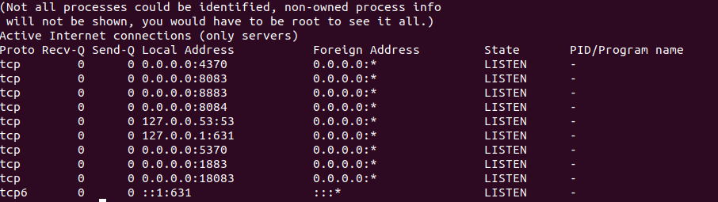

# MQTT C++ client for Embedded platforms

[paho.mqtt.embedded-c](https://github.com/eclipse/paho.mqtt.embedded-c) 

## Build compilation

CMake builds for the various packages have been introduced, along with Travis-CI configuration for automated build & testing.  The basic
method of building on Linux is:

```
mkdir build && cd build
cmake ..
make
```


## Install Emqx

```
curl -s https://assets.emqx.com/scripts/install-emqx-deb.sh | sudo bash

sudo apt-get install emqx

#start
emqx start
sudo systemctl start emqx

#status
emqx ctl status

#uninstall
sudo apt remove --purge emqx

```

## Config


 端口      | 描述          
 -------- | :-----------: 
 8083     | mqtt ws监听端口
 8084     | mqtt wss监听端口
 1883     | mqtt tcp监听端口
 8883     | mqtt ssl监听端口  
 18083    | http 监听端口
 4370     | erlang 监听端口
 5370     | 集群 rpc 端口     

## Web Debug

[Web debug address](https://mqttx.app/) 

